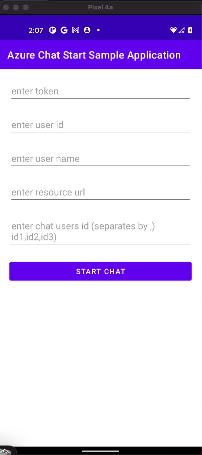
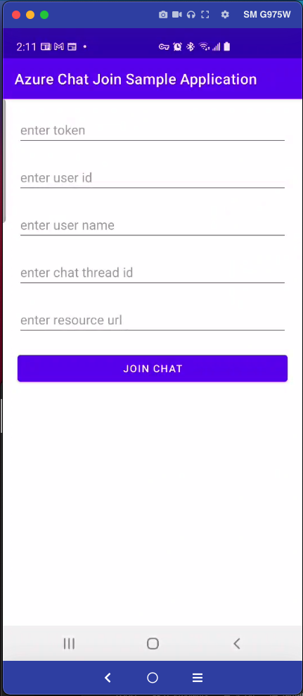
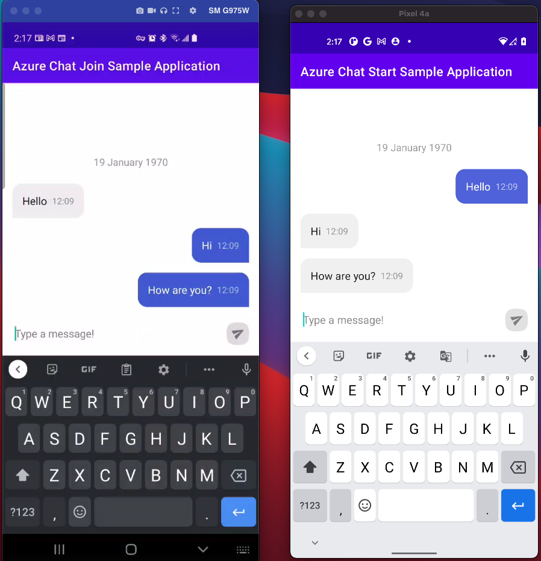

# Android Sample Chat Application using Azure Communication Services and ChatKit

This application is a project to integrate [Azure Communication Services Chat](https://docs.microsoft.com/en-us/azure/communication-services/quickstarts/chat/get-started?pivots=programming-language-android) with [ChatKit](https://github.com/stfalcon-studio/ChatKit).

## Prerequisites
- An active Communication Services resource and connection string. [Create a Communication Services resource](https://docs.microsoft.com/en-us/azure/communication-services/quickstarts/create-communication-resource?tabs=windows&pivots=platform-azp)
- Follows the instructions from [Azure Communication Services Chat](https://docs.microsoft.com/en-us/azure/communication-services/quickstarts/chat/get-started?pivots=programming-language-android) to generate Azure Communication Service Token with scope as `chat`. [access-tokens-quickstart](https://github.com/Azure-Samples/communication-services-javascript-quickstarts/blob/main/access-tokens-quickstart/issue-access-token.js)

## Run AzureChatAdmin

- Enter required information
- On `Start Chat` button click, you will see a `ThreadId` generate in `logs`. `ChatThreadID -: 19:Pk6_myvAX.....U1@thread.v2`

## Run AzureChatJoin

- Enter required information, input `threadId` from `Run AzureChatAdmin`
- Click `Join Chat` 

For more information visit: [Android Sample Chat Application using Azure Communication Services and ChatKit](https://inderpalaulakh.com/posts/azurechat/)
